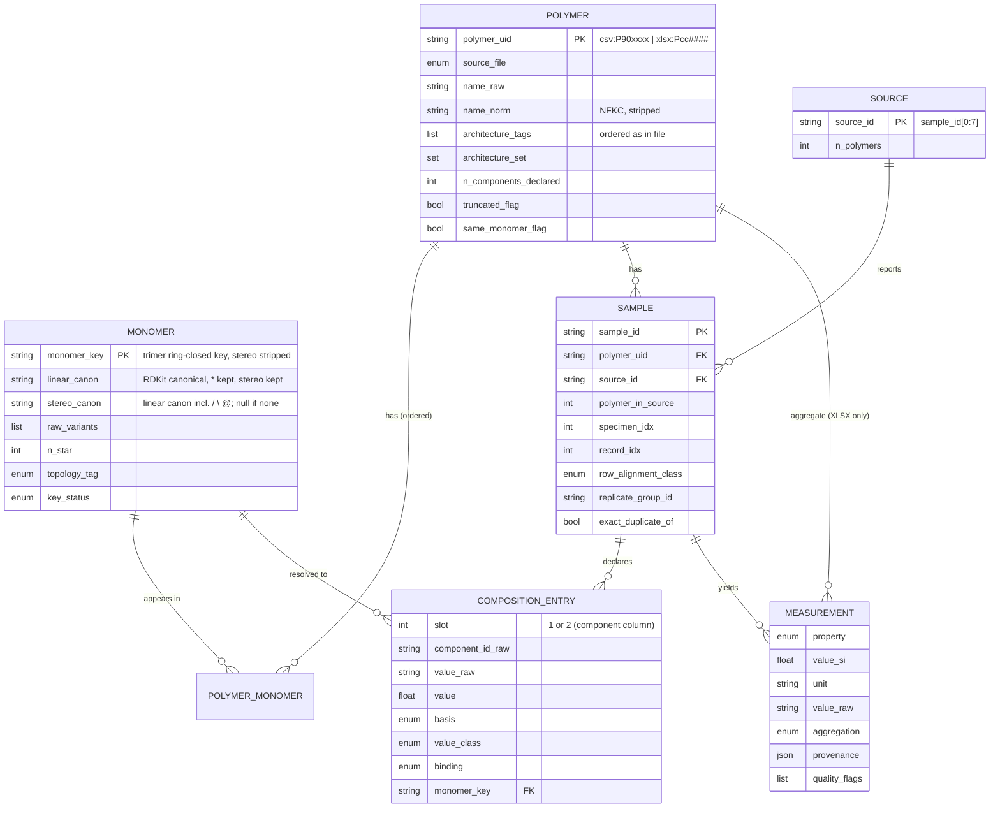

# LLM4POL — 데이터 기반 통합 보고서 (DATA FOUNDATION REPORT)

작성일 2026-09-11 · 합성자(synthesizer) 레인 · 대상 독자: PROJECT FOUNDATION PROPOSAL을 작성할 Lead Engineer
프로젝트 목표는 **아직 정해지지 않았다**. 이 문서는 목표를 고르지 않는다. "지금 있는 데이터/환경으로 무엇이 가능한가"만 정리한다.

입력 (모두 읽기 전용, 수정 없음):

| File | Shape | Status |
|---|---|---|
| `C:/Users/molsim/Dropbox/Work to do/LLM4POL/polymer_final_0824.csv` | 42,557 rows x 29 cols, 10,015,654 bytes, CRLF, no BOM | usable after the repairs in section 2 |
| `C:/Users/molsim/Dropbox/Work to do/LLM4POL/230227_Homopolymer_CanonicalSMILES.xlsx` (sheet `Homopolymer_IBMSMILES_wPD_ver2`) | 13,725 rows x 12 cols | usable after the unit renames in section 2 |
| `C:/Users/molsim/Dropbox/Work to do/LLM4POL/copolymer.zip` | 15 member CSVs, all NUL bytes | **corrupt, no data** |

근거 문서 (audit 폴더, 이 파일과 같은 위치): `copolymer-csv.md` + `refute_csv/copolymer-csv-refutation.md`, `homopolymer-xlsx.md` + `homopolymer-xlsx-refutation.md`, `cross-linkage.md` + `refute-cross-linkage.md`, `environment.md` + `environment-verification.md`, `prior-art.md` + `citation-check.md`. 합성자 자체 스팟체크: `synth_spotcheck.py` / `synth_spotcheck.out.txt`.

### 증거 등급 (evidence legend)

| Tag | Meaning |
|---|---|
| **[V]** | Claim confirmed by the independent verifier lane (re-computed or re-fetched) |
| **[V\*]** | Main conclusion confirmed; a sub-number was refuted and is replaced here by the verifier's recomputed value |
| **[X]** | Verifier-lane *extra* finding, computed once (not double-checked by a third party) |
| **[S]** | Reproduced by the synthesizer in `synth_spotcheck.py` |
| **[U]** | Unverified / unverifiable / inference |

---

## 1. 검증된 데이터 사실 (Verified data facts)

### 1.1 CSV — file format, keys, record loss

| Fact | Number | Tag |
|---|---|---|
| Encoding is **UTF-8 with 3 damaged byte sequences**, not cp949 | 51 non-ASCII bytes in 18 runs: `EF BD 90` x9 (U+FF50 `ｐ`, P900100), `EF BF BD` x6 (embedded U+FFFD), `EF BD` x3 truncated; strict utf-8 fails at byte 8,775,994 | [V][S] |
| cp949 read silently corrupts cells | 16 cells / 15 rows differ from `utf-8, errors=replace` (polymer_name 11, composition1 4, smiles1 1; ids P900100 x9, P900212 x2, P904134 x2, P908185 x2); cp949 turns `ｐo` into `節릓` and eats the `o` | [V][S] |
| One record is broken and swallows neighbours | 42,560 physical lines (42,559 records + header) vs 42,557 parsed rows; corruption `EF BD 3F` replaced the closing `}"` of P908185's quoted name (line idx 38646: 20 commas / 1 quote); 4 lines have odd quote counts; parser merges 38646+38647 and 38648+38649 | [V\*] |
| Lost / damaged records | sample `0052076-001-002-001` and `0052078-005-001-001` absent; **polymer P908186 absent entirely** (7,386 physical ids vs 7,385 parsed); 2 P908185 rows carry text fragments in `smiles1/smiles2` and ints `4`,`7` in `copolymer_type` | [V][S] |
| Keys | 7,385 `polymer_id` (all `P90xxxx`, P900001..P908686); `sample_id` unique, matches `^\d{7}-\d{3}-\d{3}-\d{3}$` 42,557/42,557 | [V][S] |
| `polymer_id` is a sound polymer key | `smiles1`, `smiles2`, `polymer_name`, `copolymer_type` constant within id for 7,384/7,385 (only P908185 varies) | [V] |
| `polymer_id` -> unordered SMILES pair is a function | 1 violation (P908185) | [V] |
| Unordered SMILES pair -> polymer_id is **not** a function | 683 of 5,322 pairs shared by >1 id, covering 26,126 rows (61.4%); multiplicity 2:402 3:122 4:58 5:25, max 79 ids; only 46 of the 683 shared pairs are `smiles1==smiles2` | [V\*] |
| Names | 83 names map to 2 ids, 7 to 3 ids, 6 to >3 ids; 18,762 names contain commas; 11 rows (2 ids) non-ASCII | [V] |
| `Unnamed: 4` | empty in all rows | [U] (stated by the audit brief; not re-verified) |

`sample_id` = `SSSSSSS-PPP-CCC-MMM` [V\*]:

| Segment | Unique | Evidence (verified) |
|---|---|---|
| seg0 (7) | 6,909 | maps to **1..85** polymer_ids (max: source 0020270, 340 rows); corr(seg0, polymer number) = 0.066 -> source / document id (the audit's "1..162" was the reverse direction: max sources per polymer_id) |
| seg1 (3) | 88 | (seg0, seg1) -> exactly 1 polymer_id in 22,440/22,440 groups -> polymer index inside the source; seg1 min != 001 in 2,936 of 6,909 sources (probably counts homopolymers not in this table) |
| seg2 (3) | 59 | composition never differs inside (seg0,seg1,seg2): 0 of 5,452 multi-row groups; two *different* Tg values in **606** groups (the audit's 3,221 counted Tg-vs-NaN) -> specimen index |
| seg3 (3) | 17 | 001: 34,943, 002: 5,458, max 017; 4,268 of 5,452 multi-row specimens differ in *property-presence pattern* -> mostly a "which property record" index, not a pure replicate index |

Source concentration: 6,513 of 7,385 ids (88.2%, 21,200 rows) come from a single source; 4,534 of 6,909 sources hold one polymer [X][S].

### 1.2 CSV — composition fields

| Fact | Number | Tag |
|---|---|---|
| Rows with no composition at all | **18,116 (42.6%)**; composition1-only 190; composition2-only 0; 18,087 of the null rows still have both SMILES | [V\*][S] |
| Ids that never have a composition | 3,323 of 7,385 ids (11,071 rows); 1,878 of the 4,578 Tg-bearing ids never have one; component ids are null in the same rows (18,114 rows both component ids null) | [X][S] |
| Grammar coverage (`parse_comp.py`) | composition1: 24,441 non-null, 24,421 recognised (99.92%), numeric 23,629 (96.68%); composition2: 24,251 / 24,240 (99.95%) / 23,267 (95.94%) | [V] |
| Basis split (composition1) | mol 16,207 / wt 5,738 / vol 228 / unknown 2,268 (2,248 parsed + 20 unparsed) | [V] |
| Residual unparsed strings | 20 (c1) + 10 (c2): `%(x/68-x)` x5, `I25/I30/I75/I70`, `a70`, `C32`, `N99.5`, `m94,0`, `mm1`, `m(a)`, ... | [V] |
| Sum classes (23,025 same-basis numeric pairs) | ==100: 18,320 (79.6%); 99..101: 18,436 (80.1%); 0.98..1.02 (fractions): 650 (2.8%); (1.02, 99): 3,562 (15.5%); >101: 314 (1.4%); <0.98: 63; max sum 34,593 | [V] |
| Mixed-basis pairs | 6 of 24,251 (0.02%), all parser residuals -> effectively 0 real mixed-basis rows | [V] |
| Exact-100 rate by prefix | m 12,373/15,857 (78.0%); w 4,346/5,255 (82.7%); v 150/181 (82.9%); u 454/507 (89.5%); r 5/23 (21.7%, values like `r10/r1`); `%`-prefix 10/10; all `%`-suffixed pairs 968/1,176 (82.3%) | [V] |
| Stray-dash values (`39%` / `-61%`) | 116 *values* = **105 rows**, 104 numeric pairs, **87** sum to exactly 100 (audit said 116 rows) | [V\*] |
| Parenthesised values `m(80)` etc. | 863 (c1) / 941 (c2) values; 277 rows both parenthesised, 221 of them sum to 100; meaning unresolved (nominal/feed?) | [V][X] |
| Relaxed-regex view (cross-linkage lane) | 21,354 both-parseable rows: m/m 14,998, w/w 4,530, none 1,188, u/u 460, v/v 155, r/r 23, 0 mixed; 17,063 (79.9%) within 100+/-1; <99: 4,023 (1,408 have >=3 units in the name); >101: 268; 2,080 rows have exactly one parseable value; 1,823 composition1 strings unparseable by the relaxed regex | [V] |
| Non-percent values in block/graft rows | 70 rows (46 block, 18 graft) have both values >=95 (`w133/w114`, `w750/w2420`, `m113/m113`) -> likely block lengths / DP | [X] |
| Extremes | >100 in 109 (c1) / 94 (c2) rows; ==0 in 57 / 129; ==100 in 204 / 49; 98 rows are 0/100 pairs (homopolymer samples inside a copolymer id) | [X] |
| Extra prefixes outside `[mwvur%]` | `i` 4, `n` 3, `mm` 1, `a` 1, `c` 1 | [V] |

### 1.3 CSV — component-id / SMILES alignment (the most important structural fact)

| Fact | Number | Tag |
|---|---|---|
| SMILES order is polymer-level; component-id order is sample-level | ordered SMILES pair varies in 1/7,385 ids; ordered component-id pair varies in **277 of 4,008** ids (unordered: 139); genuine id-swapped twin tuples: **382 in 182 ids** (audit's 504/301 included 122 `component1==component2` self-twins) | [V\*] |
| Share of rows whose component/composition order is swapped relative to the SMILES slots | audit 5,224 of 17,697 resolved rows (29.5%); verifier's independent propagation 5,333 of 17,842 (29.9%) | [V] |
| Row classes (majority component-id -> SMILES map) | aligned 15,409; swapped 2,221; half_aligned 5,309; half_swapped 881; neither 433; one_id 190; no_ids 18,114; 136 ids mix aligned and swapped rows | [V] |
| **composition_i follows component_i, not smiles_i** | P900005: `component1=CU040003` (ethyl acrylate) sits next to `smiles1=*C(C#N)C*` (acrylonitrile); `w20/40/60/80` -> Tg 91/74/48/23 C. Tg linear-mixing test: swapped rows (N=50) component-binding error 13.7 C vs SMILES-slot binding 56.8 C (45 vs 4 rows better); aligned rows (N=343) 14.1 vs 27.5 (201 vs 97); robust to Fox equation and to a |dTg|>=60 filter | [V] |
| Sign-flip test | audit's "16 of 19 ids flip" is not reproducible; robust variants: 28/36, 27/32, 24-27/30, 30/51 flip (null 50%) | [V\*] |
| Binding undetermined for half_aligned rows | 5,309 rows (12.5%): mixing test there favours the *reversed* binding (23.4 vs 15.4 C; 40 vs 69 rows) | [X] |
| Component ids are not globally unique monomer ids | 693 of 3,079 ids map to >1 SMILES (max 104 for `CU020001`); 48,696 non-null component cells; 45,636 start with `CU`, 45,599 strictly `CU`+6 digits, 37 malformed (`CU0700076` x15, `CU30010` x7, `CU900684(CU040048/CU040049)` x5, ...); 6 component values are `P90` polymer ids | [V][X] |
| Composite ids and multipart compositions | composite `(CU../CU..)` ids in 2,065 rows, 189 of them with `m(60/40)`-style compositions | [V] (audit only, consistent with verifier) |
| Re-aligning composition via the id map improves Tg monotonicity | median \|Spearman rho\| 0.878 -> 0.900 on 323 ids | [X] |

### 1.4 CSV — SMILES and RDKit

| Fact | Number | Tag |
|---|---|---|
| SMILES per row | 2: 42,438; 1: 115 (37 ids; smiles2 missing 96, smiles1 missing 19; 90 of the 115 have both component ids; only 32 names contain `x-`); 0: 4 (P904415 x1, P908136 x3) | [V\*][S] |
| `smiles1 == smiles2` | 3,952 rows / 713 ids; 792 further rows have equal SMILES with two *different* component ids (stereo/tacticity/D-L lost in SMILES); `component1 == component2` in 779 rows / 121 ids | [V][X][S] |
| `*` count over 4,792 unique SMILES | 2: 4,646; 3: 80 (459 slot occurrences); 4: 53 (203); 6: 6; 8: 2 (3); 16: 1 (POSS cage, contains `[Si]`); 0: 4 (text fragments from P908185) | [V] |
| RDKit failures | 10 of 4,792 unique (6 carborane `[B]` clusters parse with `sanitize=False`; 4 text fragments); **30 distinct rows in 9 ids** (P901377 8, P901378 4, P907666 4, P907667 4, P904273 3, P904274 3, P908185 2, P904536 1, P904537 1) — the audit's "46 rows" counted slot occurrences | [V\*] |
| Canonicalisation | 4,782 valid -> 4,782 canonical (collapses nothing); 257 charged; 74 with `/` `\`; 0 with `@`; 1 with `.`; 26 with `[2H]`; 317 with Si | [V][X] |
| Attachment-point variants | deleting `*` and re-canonicalising collapses 4,782 -> 4,666 backbones (116 SMILES are the same monomer with different cut points) | [X] |

### 1.5 CSV — properties, units, coverage

Units (verified by cross-file reconciliation, section 1.9): Tg/Tm **degC**, density g/cm3, elongation %, modulus/stress plausibly GPa, resistivity ohm*cm, conductivity S/cm.

| Property | n | min | p1 | median | p99 | max | Flags | Tag |
|---|---|---|---|---|---|---|---|---|
| glass_transition_temperature (C) | 18,142 | -151.35 | -110 | 52.55 | 338 | 455 | 55 zeros; 5,687 negatives; Tg > Tm in 78 of 3,728 rows with both; Tg/Tm(K) < 0.4 in 41, > 0.9 in 186 | [V][S] |
| melting_temperature (C) | 8,713 | -68 | -7.88 | 128 | 375 | 533 | | [V][S] |
| density (g/cm3) | 3,104 | 0.024 | 0.581 | 1.096 | 2.20 | 6.194 | >5: 9; <0.5: 29 (P900016 EVA 0.024..0.127); >3: 25 | [V][S] |
| tensile_modulus (GPa) | 3,709 | 8e-8 | 7e-5 | 0.255 | 62.8 | 916 | >100: 25; >10: 94; <0.01: 929 | [V][S] |
| tensile_stress_strength_at_break (GPa) | 5,046 | 0 | 1.7e-4 | 0.0185 | 11.06 | 580 | >500: 2; >1: 89 (likely MPa) | [V][S] |
| elongation_at_break (%) | 5,072 | 0 | 1.1 | 250 | 1,800 | 6,190 | >2000: 32 | [V][S] |
| refractive_index | 684 | 1.295 | 1.344 | 1.53 | 2.266 | 2.467 | none | [V][S] |
| volume_resistivity (string) | 4,031 | | | log10 median 4.08 | | | units glued: `ohm*cm` 4,016 (1 unit-only), `ohm*m` 11, `[NR]` 4; 4,015 parse; **0 parse as float directly** | [V][S] |
| electric_conductivity (string) | 4,060 | | | log10 median -4.09 | | | `1/(ohm*cm)` 4,048 (3 unit-only), `mS/cm` 10, `ohm/m` 2; 4,045 parse; 6 zeros; 4 values > 1e6 S/cm | [V][S] |

Resistivity and conductivity are present together on 4,015 rows; log10(res*cond) median 0.0000 (IQR 0.004); 351 pairs deviate by > 0.05 decades, 33 by > 0.5; 30 rows have conductivity only [V][X]. Parsing trap: `'2e-161/(ohm*cm)'` means 2e-16 in `1/(ohm*cm)`; a greedy number regex misreads 2,061 of 4,048 strings [V].

Coverage: 0 properties 11,151 rows (26.2%); 1: 17,839; >=2: 13,567 (31.9%). Largest joint blocks: Tg&Tm 3,728; stress&elongation 4,446; modulus&elongation 2,891; res&cond 4,015; Tg&modulus 1,273; density&Tg 1,119 [V]. 1,301 ids (17.6%) have no property in any row [X].

### 1.6 CSV — replicates and duplicates

| Fact | Number | Tag |
|---|---|---|
| Tg replicates | grouping 18,142 Tg rows by (polymer_id, basis, comp1, comp2) gives 10,163 groups; 2,243 groups hold >1 row = **10,222 rows (56.3%)**; 2,018 with >1 distinct value; within-group SD p25/p50/p75/p90/p95/p99 = 2.1/7.0/15.7/33.1/52.4/120 C; 872 groups span >20 C, 355 >50 C; 650 physical specimens have >1 Tg row (median SD 4.95 C) | [V] |
| Within-polymer Tg scatter | 2,667 ids have >=2 Tg samples; median within-id range 20.2 C; 588 ids exceed 50 C | [X] |
| Tm replicates | 1,133 groups hold 5,057 of 8,713 Tm rows (58%); SD median 5.2 C, p90 32.6 | [X] |
| **Exact duplicate records** | 6,548 rows identical to another row on every column except `sample_id` (9,047 rows in 2,499 groups, 1,285 ids); 1,355 duplicates carry a property (462 ids); 1,979 groups span >1 specimen, 548 span >1 source | [X][S] |
| Terpolymers truncated to two slots | names with >=3 repeat units: 7,389 rows (17.4%, 1,320 ids) liberal count; **4,243 rows / 548 ids** counting only `-co-/-alt-/-block-/-graft-` links; 3,709 of the liberal set carry a 2-component composition, 1,440 of those sum to exactly 100 | [X][S] |

### 1.7 CSV — `copolymer_type` and names

| Fact | Number | Tag |
|---|---|---|
| Parses as Python list literal | 42,555 lists + 2 ints (broken record); list lengths 1: 30,778 / 2: 10,979 / 3: 794 / 4: 6; **>=2 tags 11,779 rows (27.7%) / 2,723 ids** | [V][S] |
| Vocabulary | 29 distinct tag *sets* (59 distinct ordered lists); exploded frequencies: unspecified 28,938; alternating 9,346; random 6,821; block 6,814; graft 2,740; statistical 471; periodic 10; `['unspecified']` alone 20,843 rows (49.0%); 8,095 multi-tag rows contain `unspecified` | [V][X] |
| Polymer-level attribute | tag set varies within id in 1/7,385 (P908185) | [V] |
| Name/tag consistency is one-directional | multi-tag rows with `-alt-` in name: **5,255** (1,198 ids; audit said 4,892); alternating tag without `-alt-`: 4,033 rows; block tag without `-block-`/`-b-`: 4,766; graft tag without `-graft-`/`-g-`: 1,498; `-alt-` in name without the tag: 5 | [V\*][X] |
| Homopolymers inside the copolymer export | 386 rows / 27 ids have `polymer_name` string-equal to an XLSX `iupac` (e.g. `polyisoprene`) | [X] |

### 1.8 XLSX — identity and structure

| Fact | Number | Tag |
|---|---|---|
| `pid` | 13,725 unique / 13,725; all `^P\d{6}$`; 43 class codes (01-21, 31-52); largest P37 2,320, P43 2,224; sub-series meaning of the 3rd digit (0/2/4/9) is an inference | [V][S] / [U] |
| Namespace disjoint from CSV | 0 pids equal a CSV `polymer_id`, a component id (2,938 id tokens incl. composites) or a `sample_id`; 1,353 of 2,671 CU ids share their 6 digits with a pid but only 293 of 852 testable pairs are the same structure (386/852 or 557/1,352 under looser definitions) -> **not a join key** | [V][S] |
| `polymer_smiles` vs `CanonSMILES` | 6,702 rows differ as strings; 0 RDKit failures in either column; same structure in 13,725/13,725; `CanonSMILES` string-equals RDKit 2025.09 canonical output for 13,579 (146 differ: 102 with bracketed metals/metalloids, 3 with `*=`/`=*`); string-equals `polymer_smiles` in 7,023 | [V] |
| Structural duplicates | 91 `CanonSMILES` shared by 2-4 pids (192 rows, 101 excess; multiplicity 2:82, 3:8, 4:1); 27 groups have identical names, ~30 differ only by a cis/trans/cyclo-type prefix (audit's "41" not reproducible), 34 have genuinely different names of which >=10 are name/SMILES conflicts (P373700/P373706, P370074/P372152, P080004/P080006, P180010/P180011, P070662/P070663, P310008/P310009, P342364/P342365, P392035/P392036, P310015/P312030); 33 groups have >=2 Tg, **30 conflicting, max spread 169 K** | [V\*] |
| Stereo | 30 `CanonSMILES` / 35 `polymer_smiles` carry `@` `/` `\`; 5 rows lose marks in canonicalisation (P342268, P342368, P372081, P372966, P372967) | [V][X] |
| `*` counts (both columns identical) | 2: 13,637; 3: 63; 4: 21; 0: 3 (P370214, P522049, P522050 — unusable as repeat units); 8: 1 (P382512); 133 rows with `*=`/`=*` | [V] |
| Unit-length duplicates | P312047 `*C*` vs P010001 `*CC*`; P050006 PTFE `*C(*)(F)F` vs P350006 `*C(F)(F)C(*)(F)F`; 12 rows have <=2 heavy atoms | [X] |
| Fully duplicated rows | P330074/P330075; P472170/P472173 | [X] |
| `iupac` | 13 null (contiguous P39 polyester block, all with Tg); 13,477 unique of 13,712; 206 names duplicated (235 excess); 178 names -> >1 CanonSMILES; 78 duplicate-name groups with >=2 Tg, 77 conflicting, max spread 212 K; 212 names not starting with `poly`; 9 corrupted leading tokens (`pol(`, `pol[`, `poy(`, `poyl(` ...); 11 rows `hydoxymethyl`; 212 names with unbalanced brackets; 1 name (P510041) with cp949 mojibake U+7BC0 + `?` (0 U+FFFD) | [V\*][X] |
| Sheet-name tokens `IBMSMILES`, `wPD`, `ver2`, `230227` | inference only: RDKit-style canonical column from an external pipeline; "with property data"; 2023-02-27 export | [U] |

### 1.9 XLSX — properties and units

| Column | n | min | 1% | median | 99% | max | Verdict | Tag |
|---|---|---|---|---|---|---|---|---|
| Tg_K | 7,733 | 138 | 195 | 410 | 657 | 768 | **Kelvin** (0 values < 100 K; KS vs CSV degC 0.906 raw -> 0.331 after -273.15; 6,932 integers + 801 half-integers, 0 values ending `.15`; 914 distinct values, mode 503 K x53) | [V][S] |
| melting_temp_K | 3,696 | 211 | 248 | 461.75 | 768 | 853 | Kelvin; 78 < 273 K; 25 of 1,474 rows have Tm < Tg; 2,222 Tm-without-Tg (P09 315, P10 289, P37 222, P07 210, P39 190), some look like misfiled Tg (PVAc P030024 314 K, PBA P040006 318 K) | [V][X] |
| density_g_per_cm3 | 1,651 | 0.23 | 0.86 | 1.23 | 1.868 | 2.9 | g/cm3; P382422 0.23, P512008 0.66, P362049 0.76 low; 2.865 / 2.9 plausible (Br/Se) | [V] |
| Volume_resistivity__ohmXcm | 1,268 | 6.7e-8 | | 1.05e7 | | 2.5e18 | log10 range -7.17..18.40; 109 exact powers of ten | [V][X] |
| Electric_conduct_1_per_ohmXcm | 1,296 | 1e-18 | | 1.1e-5 | | 1.9e7 | 110 rows > 1 S/cm, 7 > 1000; max 1.9e7 is **P462344** (paired rho 1.05e9, 16 decades inconsistent), poly(glycine) P100169 is 2.0e6; 101 exact powers of ten | [V\*][X] |
| Elongation_at_break_GPa | 1,059 | 0.45 | 1.5 | 11.0 | 712 | 3000 | **percent, not GPa** (1,055 > 1; 125 > 100; 5 > 1000) | [V][S] |
| Tensile_modulus_GPa | 1,003 | 1e-5 | 0.0024 | 2.1 | 34.9 | 180.75 | GPa; 6 values > 50 (P190001 180.75), 20 < 0.01 | [V][X] |
| Tensile_stressAt_break_GPa | 1,064 | 9e-5 | 0.00126 | 0.081 | 0.845 | 64.02 | GPa; 3 > 10 (P100143 64.02, P100126 35.08, P070232 34.11); stress > modulus in 14 of 896; stress/modulus > 0.5 in 17 | [V][X] |

Resistivity vs conductivity (1,268 overlapping rows): Pearson r(log10) = -0.858; |log10(rho*sigma)| < 0.5 in 842 (66.4%); >= 1 decade in 371 (29.3%), always sigma > 1/rho; max 17.65 decades (P130124); exact reciprocals to rtol 1e-6 with atol=0: **156** (audit's 549 was an `np.isclose` atol artefact) [V\*]. 155 conductivities are bitwise 1/rho and 137 resistivities bitwise 1/sigma; float-noise patterns (`...99999`) in 186 cond / 70 res / 56 density / 21 modulus / 28 stress / 6 elongation values vs 0 in Tg/Tm -> the electrical/mechanical columns passed through arithmetic before export [X].

Coverage: 0 properties **2,338 rows (17.0%)**; 1: 6,881; 2: 2,861; >=3: 1,645; all 8: 2; Tg-only 4,663; every resistivity row has conductivity (1,268), 28 conductivity-only [V][S]. The 12 named benchmark pids (PE P010001, PS P020001, PMMA P040048, PVC P050002, PET P090027, PDMS P170031, PTFE P050006, PVA P030001, PAN P030010, PEO P070013, PCL P090089, PLA P090176) have 0/8 properties [V], **but** the same structure carries data under a second pid for PS (P322231 Tg 367 K), PDMS (P374137 Tg 151 K, density 0.97), PTFE (P350006) and PVDF (P350007) [V caveat]. Zero-property rows by class: P37 387, P43 384, P40 234, P46 174, P39 172; by fraction P49 61%, P51 38%, P42 37% [V].

### 1.10 Cross-file linkage

| Fact | Number | Tag |
|---|---|---|
| Shared identifiers | none (0 overlaps in every direction) | [V][S] |
| Unique CSV monomer SMILES (4,792) matched to an XLSX repeat unit | naive string 118 (2.46%); RDKit linear canonical 1,725 (36.0%); cut-point-invariant "periodic" key 2,060 (43.0%) | [V] |
| CSV two-SMILES rows (42,438) with both / one / neither monomer matched | naive 2,331 / 12,968 / 27,139; linear 28,480 / 8,598 / 5,360; periodic **32,994 (77.75%)** / 7,717 / 1,727 (4.07%); 4,680 of the 32,994 are pairs sharing one key (same-monomer "copolymers") | [V][X] |
| Structure bridge XLSX -> CSV | 1,776 XLSX rows (1,725 unique structures) equal a canonical CSV monomer; 1,059 of them have Tg, 279 have no property | [X] |
| Periodic (ring-closing) key is **unsound through rings** | XLSX: of 22 keys merging >1 linear canon, 14 true cut-point variants, 3 stereo-only, **5 false merges** (P472317/P472318, P462146/P462351, P462145/P462347, P462065/P462144, P070074/P370826); CSV: 13 merging keys = 11 stereo-only + **2 false merges** (PPS vs poly(thienylene vinylene); 2-Me-THF vs epoxide); cross-file: of 336 SMILES gained over linear canon, 323 true, 12 stereo-only, 1 false (P905924). A trimer key (3 concatenated units, ring-closed, stereo stripped) separates all of them | [V\*] |
| XLSX key counts | 13,624 linear-canonical / 13,602 periodic keys; 108 periodic keys shared by >1 pid | [V] |
| Unit reconciliation via near-homopolymer rows (dominant component >= 95) | Tg: N=254 rows (104 ids), median \|CSV - (Tg_K - 273.15)\| = **15.35 C** vs 264.0 without offset (56.7% within 20 C); Tm: N=78, 42.0 vs 283.0; density: N=24, 0.087 g/cm3 (m-basis 0.01) -> **CSV degC / XLSX K; density same unit**. Caveat: 21 of the 254 Tg rows come from block/graft rows where both values >= 95 | [V][X] |
| Mechanical units | stress N=84 (17 ids) median ratio CSV/XLSX 0.77; elongation N=81 ratio 0.90; modulus N=12 ratio 0.87 -> both GPa-scale and %; global medians differ (0.255 vs 2.1 GPa) because the CSV is elastomer-heavy | [X] / [U] for modulus (N=12) |
| 115 single-SMILES CSV rows | not homopolymers (90 have two component ids; 108 names have a copolymer separator; exception P902940 x7); periodic match 106/115; Tg agrees with the matched homopolymer, N=28 median 7.05 C | [V] |
| **Usable core for copolymer property work** | 13,350 rows (2,735 ids) have both monomers matched to XLSX homopolymers **and** a Tg; 6,917 rows (1,381 ids) additionally have both compositions parseable | [X] |
| Tg vs composition monotonicity | 378 ids with >=5 distinct same-basis compositions summing 99-101: median \|Spearman rho(Tg, composition1)\| 0.868; 234 ids > 0.7, 67 < 0.3 (EVA P900016 rho 0.20, SAN P900007 -0.06, P900492 0.12 are physically flat/mixed-order) | [V] |

### 1.11 Corrections applied (numbers that did not reproduce)

All corrected values are already used above. The full list of dropped/refuted sub-claims is in the footnote of section 6 and in the structured output field `refuted_claims_dropped`.

---

## 2. 데이터 결함과 하류 영향 (Data defects, severity-ranked)

Severity: **S1** = silently corrupts any downstream result if ignored; **S2** = biases results / must be modelled explicitly; **S3** = limits scope or needs a decision; **S4** = cosmetic / flag-and-carry.

| ID | Sev | Defect (verified numbers) | Implication for *any* downstream use | Deterministic remedy available? |
|---|---|---|---|---|
| D1 | S1 | Composition/component order is sample-level and swapped relative to the SMILES slots in ~30% of resolvable rows (2,221 fully swapped, 881 half-swapped, 5,309 undetermined, 433 unresolvable); `composition_i` belongs to `component_i`, never to `smiles_i` [V][X] | Any model, table, prompt or plot that pairs `composition1` with `smiles1` by column position is wrong for roughly a third of the rows; the Tg-vs-composition slope flips sign. Also breaks Fox/linear-mixing baselines and any "dominant component" logic | Partly: majority-vote id->SMILES map resolves 1,963-1,964 of ~2,635 ids; 12.5% of rows remain undetermined without the original PoLyInfo component records |
| D2 | S1 | File is UTF-8 with 3 corrupted sequences, not cp949; cp949 read mangles 16 cells; the broken P908185 record swallows 2 physical records, P908186 is lost, 2 rows carry garbage in `smiles1/2`/`copolymer_type` [V][S] | Reading with `cp949` (as the brief instructs) silently alters 15 rows; the two garbage rows produce 4 fake "SMILES" and 2 non-list `copolymer_type` values that crash naive parsers | Yes: read `utf-8, errors=replace`; drop or hand-repair the 2 P908185 rows; record P908186 as missing |
| D3 | S1 | Electrical properties are strings with the unit glued on; `1/(ohm*cm)` makes a greedy parse read `2e-161` (2,061 of 4,048 strings misread); 0 values parse as float directly [V][S] | Any `pd.to_numeric` / regex-first pipeline gets 30-decade errors; the two columns are reciprocal on 4,015 rows (median log10 product 0.0000) so they are one measurement, not two | Yes: strip the unit token with an anchored regex, log10-transform, keep one column |
| D4 | S2 | Replicates and exact duplicates: 56.3% of Tg rows sit in replicate groups (SD median 7.0 C, p90 33 C); 6,548 rows are exact duplicates except `sample_id` (1,355 with a property); Tm 58% replicated [V][X][S] | Random row-level splits leak; per-row metrics understate error; duplicates double-weight samples; a sample-level table is not a polymer-level table | Yes: dedup on all columns but `sample_id`; group by (polymer_id, basis, comp1, comp2); split by polymer_id (or by source seg0) |
| D5 | S2 | 42.6% of rows (18,116) and 45% of ids (3,323) have no composition at all; component ids are missing in the same rows; 1,878 of 4,578 Tg-bearing ids never have a composition [V][X][S] | Composition-aware modelling can use at most ~24 k rows / ~4 k ids; the rest is "copolymer with unknown ratio" and must be modelled separately or dropped | No (missing data); the "usable core" is 13,350 rows / 2,735 ids with Tg and both monomers matched, 6,917 rows / 1,381 ids with parsed compositions |
| D6 | S2 | Terpolymers truncated to two SMILES/component slots: 4,243 rows / 548 ids (conservative) to 7,389 rows / 1,320 ids (liberal); `component3..5` columns are empty; `x`/`N-x` compositions are the algebraic residue of a dropped third unit [X][V] | Two-component compositions that sum < 100 (4,023 rows) are often not errors but truncation; sequence/architecture labels refer to a polymer the table cannot represent | Partly: flag from the name (link-word count) and from sum < 99; true repair needs a fuller export |
| D7 | S2 | Composition notation is heterogeneous: only 79.6% of same-basis pairs sum to exactly 100; 2.8% are fractions, 15.5% partial/ratio, 1.4% unit counts (`m992/m8`), 70 block/graft rows carry DP-like values; prefixes `u`, `r`, parenthesised `m(80)` have unresolved semantics; 1,751 parenthesised values [V][X] | A single "fraction of component 1" number is not recoverable for ~20% of composition rows without an interpretation rule; percent vs fraction vs ratio must be classified per row | Mostly: the grammar recognises 99.9% and classifies by sum; semantic questions (u/r/paren) need the owner |
| D8 | S2 | XLSX column/unit mislabels and cross-file unit mismatch: `Elongation_at_break_GPa` is percent; `Tg_K`/`melting_temp_K` are Kelvin while CSV Tg/Tm are degC; mechanical outliers (stress 64 GPa, modulus 180 GPa, 14 rows stress > modulus; CSV 89 stress > 1 GPa, 25 moduli > 100 GPa) look like MPa/GPa confusion [V][X] | Any join of the two files on temperature needs +273.15 on the CSV side; the elongation column name will mislead an LLM or a human; a handful of rows dominate error metrics in the mechanical columns | Yes for renames/offset; outliers must be flagged (about 60 XLSX rows, ~120 CSV rows) not silently fixed |
| D9 | S2 | XLSX conductivity/resistivity are not reciprocals for 371 of 1,268 pairs (>= 1 decade, always conductivity too high); 110 conductivities > 1 S/cm, 7 > 1000; values show arithmetic float-noise (computed, not typed) [V\*][X] | The two XLSX columns come from different samples/aggregations; treating them as one target or as redundant is wrong; extreme conductivities are physically impossible for polymers | Partly: flag pairs with |log10(rho*sigma)| > 0.5; cap/inspect > 1e4 S/cm |
| D10 | S3 | Structural identity is ambiguous at three levels: (a) attachment-point variants (116 CSV SMILES; PET/polybutadiene matched only after cut-point normalisation), (b) the ring-closing "periodic" key falsely merges topologically different polymers (5 XLSX, 2 CSV, 1 cross-file), (c) stereo is carried by only 74 CSV / 35 XLSX strings and merged by any ring-closed key (11 CSV cis/trans cases); XLSX has 91 duplicate-structure groups with 30 conflicting Tg (max 169 K) and >= 10 name/SMILES conflicts [V\*][X] | Dedup, cross-file joins and scaffold/UMAP splits all depend on the structure key; a wrong key either leaks (merges) or fragments (splits) the same polymer; duplicate structures with different targets cap achievable RMSE | Yes for (a)/(b): trimer ring-closed key + stereo-aware linear canon; (c) and the XLSX conflicts need a decision (average vs keep vs drop) |
| D11 | S3 | Same-monomer "copolymers" and homopolymers in the copolymer export: 3,952 rows / 713 ids have `smiles1 == smiles2`; 4,756 rows / 757 ids share one periodic key; 386 rows / 27 ids have a homopolymer name; 98 rows are 0/100 compositions [V][X][S] | Inflates "both components matched" (14% of 32,994) and copolymer counts; block/graft entries encode only one unit so architecture is lost | Yes: flag `smiles1 == smiles2` (or same key) and route to a homopolymer/architecture-only path |
| D12 | S3 | XLSX property join is incomplete: 2,338 rows (17%) property-free including PE/PS/PMMA/PVC/PET/PEO/PLA/PCL under their primary pids (PS/PDMS/PTFE/PVDF have data under a second pid); provenance/aggregation rule for the one-value-per-pid columns is unknown (Tg integer/half-integer) [V][X] | "Polymers with data" filters drop the canonical benchmark polymers; per-pid numbers cannot be traced back to samples; cannot be compared with CSV sample-level values without an aggregation assumption | No (needs the owner or a fuller export) |
| D13 | S3 | `copolymer_type` is a polymer-level multi-tag list with unclear semantics (27.7% multi-tag, 29 sets / 59 ordered lists, 49% plain `unspecified`); name/tag agreement is one-directional (4,033 alternating-tag rows lack `-alt-`) [V\*][X] | Architecture-aware modelling (block vs random) can only trust ~half of the rows; `unspecified` is a filler not a class | Partly: drop `unspecified` from multi-tag lists; treat remainder as multi-label; semantics need the owner |
| D14 | S3 | Source leakage: 88.2% of ids come from one source; 4,534 sources hold one polymer; seg3 mostly indexes property records, not replicates [X][V\*] | Grouped CV by source and by polymer_id are nearly the same; a "paper-held-out" split gives little extra protection; the sample_id semantics cannot be used as a replicate key without checks | Yes: split by polymer_id (and by structure family) instead |
| D15 | S4 | Physical outliers and text hygiene: density 0.024..6.194 g/cm3 (29 < 0.5, 9 > 5); Tg > Tm in 78 rows; 41 rows Tg/Tm(K) < 0.4; XLSX 25 Tm < Tg; 9 corrupted `poly` tokens, 212 unbalanced-bracket names, 13 null names; 11 full-width `ｐ` names; 10 RDKit-invalid SMILES (6 carboranes) [V][X] | Small counts; matter only for range validators and name-based lookups | Yes: range warnings, NFKC-normalise names, `sanitize=False` fallback for carboranes |
| D16 | S1 (scope) | `copolymer.zip` is entirely NUL bytes (15 member CSVs) | Whatever that archive was meant to add (likely the wider copolymer export) is unavailable; nothing in the audit can be attributed to it | No; re-obtain from the owner |

---

## 3. 통합 도메인 모델 제안 (Proposed unified domain model — PROPOSAL, not fact)

Taken from the cross-linkage lane's proposal; changes forced by the verification are listed in 3.3. Everything here is a design proposal to be ratified in the foundation proposal, not a description of the raw files.

### 3.1 Entities and relationships

### 3.2 Field specification (transforms are deterministic and reversible where marked)

**Monomer** (one row per distinct repeat unit; both files)

| Field | Source | Transform | Lossless |
|---|---|---|---|
| `monomer_key` (PK) | `smiles1/2`; `polymer_smiles` | **trimer ring-closed key**: concatenate 3 copies of the unit through the two `*`, close the ring, strip stereo, RDKit canonical. Falls back to `linear_canon` when `n_star != 2`, a `*` has degree != 1, or sanitisation fails (`key_status` records why) | no (stereo dropped by design; recorded in `stereo_canon`) |
| `linear_canon` | same | `Chem.MolToSmiles(Chem.MolFromSmiles(s.strip()))`, `*` kept | yes (up to RDKit version) |
| `stereo_canon` | same | `linear_canon` only if the raw string carries `/`, `\` or `@`; else null | yes |
| `raw_variants` | same + `CanonSMILES` | all distinct raw strings observed for this key | yes |
| `n_star`, `topology_tag` | same | count `*`; 2 -> `linear2`; 3-4 -> `branched`; 6/8/16 -> `multiarm`; 0 -> `terminal_only` (XLSX 3 rows) or `malformed` (CSV 4 text fragments); RDKit fail -> `unparsed` (6 carboranes: keep `sanitize=False` mol) | yes |
| `xlsx_pids`, `csv_component_ids` | pid; component1/2 | all pids sharing the key; component ids whose majority SMILES lands here (advisory only, 693/3,079 ids are ambiguous) | n/a |

**Polymer** (one row per CSV `polymer_id`, one per XLSX `pid`)

| Field | Source | Transform |
|---|---|---|
| `polymer_uid` | polymer_id / pid | prefix `csv:` / `xlsx:` (namespaces are disjoint anyway) |
| `name_raw`, `name_norm` | polymer_name / iupac | keep raw; `name_norm` = NFKC (turns `ｐ` U+FF50 into `p`), strip, CRLF removed; flag the 2 CSV mojibake ids, XLSX P510041, the 9 corrupted `poly` tokens and 13 nulls |
| `architecture_tags` (ordered list) and `architecture_set` | copolymer_type | `ast.literal_eval`; XLSX const `['homopolymer']`; the 2 int values from P908185 -> `['unknown']` + flag; vocabulary {unspecified, random, statistical, alternating, block, graft, periodic, gradient, homopolymer, unknown} |
| `monomers` (ordered list of `monomer_key`) | smiles1, smiles2 / polymer_smiles | order as in the file (assumed = name order; unverified) |
| `n_components_declared` | polymer_name | 1 + count of `-co-|-alt-|-block-|-graft-` links (conservative) ; second estimate counting `/` inside braces (liberal) |
| `truncated_flag` | derived | `n_components_declared > len(monomers)` (4,243 rows conservative / 7,389 liberal) |
| `same_monomer_flag` | derived | `monomers[0] == monomers[1]` at key level (4,756 rows) |

**Source** (CSV only): `source_id = sample_id[:7]`; `n_polymers` (1 for 4,534 of 6,909 sources).

**Sample** (CSV only; XLSX rows are polymer-level aggregates and get no Sample)

| Field | Transform |
|---|---|
| `sample_id`, `source_id`, `polymer_in_source`, `specimen_idx`, `record_idx` | split `SSSSSSS-PPP-CCC-MMM`; validate the regex; `record_idx` is documented as "property-record index" (not replicate) |
| `row_alignment_class` | enum {aligned, swapped, half_aligned, half_swapped, neither, one_component_id, no_component_ids} from the majority id->SMILES map |
| `replicate_group_id` | hash of (polymer_uid, basis, value1, value2) after parsing |
| `exact_duplicate_of` | first `sample_id` of the duplicate group when all columns except `sample_id` are equal (6,548 rows) |

**CompositionEntry** (0-2 per Sample; the slot is the *component* column, never the SMILES column)

| Field | Transform |
|---|---|
| `value_raw`, `basis`, `value`, `flags` | `parse_comp.py` grammar: prefix m/w/v -> mol/wt/vol; `u`, `r`, `%`, none -> basis `unknown_u` / `ratio_r` / `unknown_pct` / `unknown`; flags {pct_suffix, stray_dash, paren, approx, bound, range, expression, multipart, variable, missing, blank, mojibake} |
| `value_class` | from the pair sum: `percent` (99..101), `fraction` (0.98..1.02), `partial_or_ratio` (1.02..99), `count_like` (> 101), `single` (only one value), `none` |
| `binding` | `by_component_majority` (id's majority SMILES equals smiles1 or smiles2), `by_position_aligned_only` (row class aligned), `undetermined` (half_aligned/half_swapped/neither), `unresolved` (no ids) |
| `monomer_key` | resolved through `binding`; null when undetermined |
| `value` has **no upper bound** in the schema (109/94 values > 100 exist); the bound is enforced only for `value_class == percent` |

**Measurement** (CSV: one per non-null property cell per Sample; XLSX: one per non-null property cell per Polymer)

| Field | Transform |
|---|---|
| `property` | Tg, Tm, density, E, sigma_b, eps_b, rho_v, sigma_e, n_D |
| `value_si`, `unit` | Tg/Tm: CSV `+273.15` -> K, XLSX as is; density g/cm3; eps_b % (XLSX column renamed from `_GPa`); E, sigma_b GPa (CSV unit assumed from N=12/84 comparisons — flag as `unit_assumed`); rho_v: strip unit, `ohm*m` x100 -> ohm*cm, `[NR]` -> null; sigma_e: strip unit, `mS/cm` x1e-3 -> S/cm, `ohm/m` -> null + flag |
| `aggregation` | CSV `single_record`; XLSX `polymer_aggregate_unknown` (evidence of arithmetic: float noise, 155 bitwise reciprocals; Tg integer/half-integer) |
| `quality_flags` | range warnings (section 4), `duplicate_record`, `reciprocal_pair` (CSV rho/sigma), `non_reciprocal_pair` (XLSX 371), `stress_gt_modulus`, `tm_lt_tg`, `unit_assumed`, `garbage_row` (P908185) |
| `provenance` | {file, row_index, column, sample_id or pid, raw string} |

### 3.3 What changed relative to the cross-linkage proposal (and why)

| Item in the original proposal | Verifier finding | Change |
|---|---|---|
| `monomer_key` = ring-closing "periodic" key | falsely merges 5 XLSX, 2 CSV and 1 cross-file pairs of topologically different polymers; a trimer key separates all | primary key = **trimer ring-closed key**; periodic key dropped |
| "22 genuine cut-point variants" in XLSX | 14 genuine, 3 stereo-only, 5 false | numbers corrected; stereo-only merges recorded via `stereo_canon` |
| `CompositionEntry.value` max 100 | 109/94 values > 100; DP-like block values; unit counts | bound removed; `value_class` added |
| `resolution` enum {by_component_majority, by_position, unresolved} | binding undetermined for 5,309 half_aligned rows (mixing test favours the reverse) | `binding` enum gains `undetermined`; `by_position` allowed only for `aligned` rows |
| `sample_id` = source-sample-condition-replicate (guess) | (seg0,seg1) -> 1 polymer_id; seg2 = specimen; seg3 = property-record index in 4,268/5,452 cases | segment names fixed as above; `Source` entity added for grouped CV |
| Non-ASCII names = cp949 mis-decoding, "not U+FF50" | raw bytes are UTF-8 U+FF50 | loader reads UTF-8; `name_norm` via NFKC |
| Broken record explained by "embedded CRLF" | corrupted `EF BD 3F` replaced `}"`; 2 physical records lost incl. P908186 | loader records the lost ids as a known gap; the 2 damaged rows are flagged `garbage_row` |
| XLSX `aggregation = polymer_median` | aggregation rule unknown; values were computed (float noise), Tg integer/half-integer | renamed `polymer_aggregate_unknown` |
| No duplicate handling | 6,548 exact duplicate rows; 2 fully duplicated XLSX rows | `exact_duplicate_of` on Sample; XLSX duplicate flag |
| No terpolymer handling | 4,243-7,389 rows name >= 3 units | `n_components_declared`, `truncated_flag` |
| 59 tag-lists treated as vocabulary | 59 ordered lists = 29 sets | keep both `architecture_tags` (ordered) and `architecture_set` |

### 3.4 Loader rules (deterministic, in order)

1. `pd.read_csv(path, encoding='utf-8', encoding_errors='replace', low_memory=False)`; assert 42,557 rows and exactly 9 U+FFFD in the frame; record that P908186 and 2 sample_ids are absent.
2. Flag the 2 P908185 rows (`copolymer_type` not a list) as `garbage_row`; do not use their `smiles1/2`.
3. Parse `copolymer_type` with `ast.literal_eval`; build ordered list and set.
4. Parse `volume_resistivity` / `electric_conductivity` with the anchored regex `^(.*?)(ohm\*cm|ohm\*m|\[NR\]|1/\(ohm\*cm\)|mS/cm|ohm/m)$` on the stripped string; float the group-1 part; convert units; log10.
5. Parse compositions with `parse_comp.py`; classify by pair sum.
6. Build the id->SMILES majority map from rows with two distinct plain ids and two distinct SMILES (20,889-20,929 rows); assign `row_alignment_class`; resolve `CompositionEntry.binding`.
7. Compute monomer keys (linear canon, stereo canon, trimer key) for the 4,792 CSV and 13,661 XLSX strings; `sanitize=False` fallback for the 6 carboranes.
8. Mark exact duplicates, replicate groups, `same_monomer_flag`, `truncated_flag`.
9. XLSX: rename `Elongation_at_break_GPa` -> `elongation_at_break_pct`; keep K; mark the 3 zero-star and 2 fully duplicated rows.
10. Emit the validator report (section 4) before any modelling step consumes the tables.

---

## 4. 결정적 검증기 불변식 후보 (Candidate invariants for a deterministic validator)

Each row: rule, why it matters, which file(s) it protects, and the status measured on the current files. "hard" = fail the load; "warn" = record and continue.

| ID | Rule | Why | Protects | Current status |
|---|---|---|---|---|
| I1 (hard) | CSV decodes as UTF-8 with exactly 9 replacement characters; a cp949 decode is rejected | cp949 silently alters 16 cells | CSV | passes with utf-8/replace |
| I2 (hard) | Parsed row count == 42,557 and physical CRLF record count == 42,559 (+ header); the difference is documented as the P908185 defect | detects any re-export or repair | CSV | 42,557 / 42,559 |
| I3 (hard) | `sample_id` unique and matches `^\d{7}-\d{3}-\d{3}-\d{3}$` | primary key | CSV | 42,557/42,557 |
| I4 (hard) | Within a `polymer_id`, `smiles1`, `smiles2`, `polymer_name`, `copolymer_type` are constant | polymer_id is the polymer key | CSV | 7,384/7,385 (P908185 is the documented exception) |
| I5 (hard) | `copolymer_type` parses to a list of known tags | vocabulary drift | CSV | 42,555 lists + 2 documented ints |
| I6 (hard) | No CSV id (polymer_id, component id, sample_id) occurs in XLSX `pid` | guards against accidental id joins | both | 0 overlaps |
| I7 (hard) | `volume_resistivity` / `electric_conductivity` are parsed only after removing the unit token; 4,015 / 4,045 numeric values expected; any value parsed below 1e-40 is an error | the `1/(ohm*cm)` trap | CSV | 0 direct floats; 2,061 misreads with a greedy regex |
| I8 (warn) | On rows with both, \|log10(rho*sigma)\| <= 0.05 for >= 90% of pairs (CSV) | proves the two columns are one measurement | CSV | 3,664 of 4,015 pass; 351 deviate |
| I9 (warn) | XLSX pairs with \|log10(rho*sigma)\| >= 1 are flagged `non_reciprocal_pair` | 371 pairs come from different samples | XLSX | 371 flagged |
| I10 (hard) | **Composition is bound to `component_i`, never to `smiles_i` by position**; a `CompositionEntry` may carry `monomer_key` only when `binding != undetermined/unresolved` | the swap defect | CSV | 15,409 aligned + 2,221 swapped resolvable; 5,309 + 881 + 433 undetermined |
| I11 (hard) | All parsed compositions of one sample share one basis | mixed bases would be meaningless | CSV | 0 real mixed pairs (6 residuals) |
| I12 (warn) | If `value_class == percent` then 99 <= sum <= 101; if `truncated_flag` then sum < 99 is expected | separates truncation from error | CSV | 18,436 in 99..101; 4,023 low (1,408 explained) |
| I13 (warn) | `value > 100` or pair sum > 101 forces `value_class in {count_like, partial_or_ratio}`; such rows are excluded from percent-based mixing rules | DP-like values in block/graft rows | CSV | 314 pairs > 101; 70 block/graft rows >= 95/95 |
| I14 (hard) | Every Monomer has a `linear_canon`; `n_star` matches `topology_tag`; `terminal_only`/`malformed` monomers cannot be members of a copolymer composition | 0-star strings and text fragments | both | CSV 4 malformed; XLSX 3 terminal_only |
| I15 (hard) | Monomer keys are idempotent: `key(key_smiles) == key` and `trimer_key` never merges two units whose `linear_canon` differ except by stereo or cut point (checked against a stored allow-list of the 14 XLSX + 323 cross-file cut variants) | the ring-closing false merges | both | 5 XLSX / 2 CSV / 1 cross-file false merges with the periodic key -> 0 with the trimer key |
| I16 (hard) | Two Monomers with equal `monomer_key` but different `stereo_canon` are linked as stereo variants and never silently merged | cis/trans polydienes | both | 11 CSV + 3 XLSX cases |
| I17 (hard) | Tg, Tm stored in K; 100 <= Tg_K <= 800; 150 <= Tm_K <= 900 | unit mix-ups | both | CSV +273.15 -> 121.8..728.2; XLSX 138..768 / 211..853 |
| I18 (hard) | XLSX `Elongation_at_break_GPa` is loaded as percent; median must be > 1 | column mislabel | XLSX | median 11.0, 1,055/1,059 > 1 |
| I19 (warn) | Range warnings: density 0.5..3.5 g/cm3; modulus 1e-3..100 GPa; stress <= 5 GPa; stress <= modulus; elongation <= 3000%; sigma_e <= 1e4 S/cm; Tg < Tm when both present | physical sanity | both | CSV: 38 density, 25 modulus, ~89 stress, 78 Tg>Tm; XLSX: 4 density, 26 modulus, 3 stress>10, 14 stress>modulus, 25 Tm<Tg, 7 sigma>1000 |
| I20 (hard) | Exact duplicates (all columns except `sample_id`) are marked before any split or aggregation | double weighting / leakage | CSV | 6,548 rows |
| I21 (hard) | Any train/test split is grouped by `polymer_uid` at minimum; replicate groups never straddle a split | replicate leakage | CSV | 56.3% of Tg rows are replicates |
| I22 (warn) | XLSX `polymer_smiles` and `CanonSMILES` agree structurally after re-canonicalisation (string equality is *not* required) | detects column drift on re-export | XLSX | 13,725/13,725 structural; 13,579 string-equal |
| I23 (warn) | XLSX duplicate-structure groups with conflicting Tg (spread > 20 K) are listed and excluded/aggregated per an explicit decision | identical inputs, different targets | XLSX | 91 groups, 30 conflicting, max 169 K |
| I24 (warn) | Near-homopolymer consistency: CSV sample with one component >= 95 (percent class) and matched homopolymer must satisfy \|Tg - Tg_hom\| <= 40 K | catches wrong matches and wrong bindings | both | 56.7% within 20 C (N=254) |
| I25 (warn) | `same_monomer_flag` rows are excluded from "two-component" statistics | inflated match rates | CSV | 4,756 rows |
| I26 (warn) | `truncated_flag` rows carry an explicit note that `component3..5` are empty | terpolymer truncation | CSV | 4,243-7,389 rows |
| I27 (hard) | Names are NFKC-normalised; no full-width or control characters remain; the 2 CSV and 1 XLSX mojibake names and the 9 corrupted `poly` tokens are on a fixed exception list | text hygiene / name lookups | both | 11 CSV rows, P510041, 9 XLSX tokens |

---

## 5. 환경 및 기존 프로젝트 관례 (Environment and prior-project conventions — facts only)

All items verified on 2026-09-11 (E01-E20 in the packet); two items were stale within minutes (marked).

### 5.1 Hardware / OS

| Item | Value |
|---|---|
| OS | Windows 11 Pro 10.0.26200 |
| CPU | Intel Core i5-14600K, 14 physical / 20 logical cores |
| RAM | 31.7 GB total (free 2.3-2.8 GB at audit time — other processes, not a limit) |
| GPU | NVIDIA GeForce RTX 5050, **8,151 MiB VRAM**, driver 610.74, driver-level CUDA 13.3 (Blackwell -> a CUDA 12.8+/13.x torch wheel is required) |
| Disk C: | 930.6 GB total, ~400 GB free |

### 5.2 Python and packages

| Item | Value |
|---|---|
| PATH python | `C:\Users\molsim\anaconda3\python.exe`, Python 3.13.9 (conda **base**) |
| Present in base | pandas 2.3.3, numpy 2.3.5, scipy 1.16.3, scikit-learn 1.7.2, rdkit 2025.9.6, pyarrow 21.0.0, pydantic 2.12.4, pytest 8.4.2, ruff 0.12.0, mypy 1.17.1, openpyxl 3.1.5, jupyter 1.1.1 |
| Absent in base | torch, transformers, peft, accelerate, lightgbm, xgboost, polars, duckdb, hydra-core, omegaconf, mlflow, wandb, dvc |
| Other conda envs | llm2auto (3.11.14, torch 2.2.0+cpu, transformers 5.5.0, no rdkit), mofviz (3.11.15), pacman (3.10.20, torch 2.13.0, CUDA unavailable), pacmof (3.10.20); conda lists llm2auto twice |
| **No environment on the machine has a CUDA-enabled torch** | both torch installs report `cuda.is_available() == False`, `torch.version.cuda is None` |
| Package managers | conda 26.1.1, pixi 0.80.0 (`C:/Users/molsim/.pixi/bin/pixi`); uv, mise, poetry, hatch absent |

### 5.3 Tooling on PATH

git 2.53.0.windows.2; gh 2.96.0 (logged in as `kn1218`, scopes gist/project/read:org/repo/workflow); node v24.14.0; npm 11.9.0; bun 1.3.10; pnpm, Docker absent; WSL not installed. Global npm packages (exactly 5): `@anthropic-ai/claude-code@2.1.268`, `@marp-team/marp-cli@4.3.1`, `@openai/codex@0.154.0`, `oh-my-claude-sisyphus@4.15.6`, `opencode-ai@1.2.25`.

### 5.4 Agent tooling: ORCA, GSD, Claude Code plugins

| Item | Fact |
|---|---|
| **ORCA ADE** | installed at `C:/Users/molsim/AppData/Local/Programs/orca`, version 1.4.167, publisher stablyai, package.json description "Next-gen IDE for parallel agentic development", homepage github.com/stablyai/orca; no README in the install (0 of 2,487 asar entries); not launched |
| **GSD — global** | **NOT installed**: `~/.claude/commands` and `~/.claude/agents` do not exist; 0 files named `*gsd*` under `~/.claude`; no npm package; not on PATH; `installed_plugins.json` lists only oh-my-claudecode@omc 4.15.6, context7 3b600518a637, everything-claude-code 1.9.0 |
| **GSD — per project (CALF20)** | installed in `C:/Users/molsim/Desktop/CALF20_DiscoveryLoop/.claude`: `@opengsd/gsd-core` v1.13.0, mode full, runtime claude, scope local (2026-09-10); 72 `gsd-*` commands, 35 `gsd-*` agents, 28 `gsd-*` hooks, `.claude/gsd-core/` runtime, `.planning/` artifacts; install mechanism `npx -y --package=@opengsd/gsd-core@latest -- <bin> --local` (package-identity.cjs line 6/16); settings allow `Bash(npx gsd-core *)` |
| Global Claude skills | `~/.claude/skills/hpc-submit` (SKILL.md + 445-line stdlib `transport.py`) and a `learned/` directory (not audited) |
| `~/.claude/settings.json` | `model: "opus"` (the audit's "fable" was refuted), 10 hook events, 42 permission allows, empty env block |
| hpc-submit skill | targets dirac1/dirac2 PBS via `qas` from gateway PC `DESKTOP-KQ6N3NT`; requires the project to provide `config/hpc.json` + `scripts/submit.py` ("if either is missing, say so and stop"); 0 occurrences of gpu/cuda in SKILL.md, transport.py, hpc.example.json; **dirac GPU availability unknown** (only a `cuda100/111` module on dirac1 is recorded in CALF20's HPC-ENV.md; dirac2 "same minus cuda"); the skill warns "Dropbox file locks are unreliable -> ledger corruption" |

### 5.5 API access (names only, no values read)

None of ANTHROPIC_API_KEY, OPENAI_API_KEY, GOOGLE_API_KEY, GEMINI_API_KEY, HF_TOKEN, HUGGINGFACE_HUB_TOKEN, WANDB_API_KEY is set (process, User or Machine scope; only `PLAYWRIGHT_MCP_EXTENSION_TOKEN` matches). `~/.claude/.credentials.json` (Claude Code OAuth) and `~/.codex/auth.json` exist; `~/.anthropic` missing. CALF20 keeps keys in a git-ignored `.env` whose variable names are LLM_PROVIDER, OPENAI_API_KEY, GEMINI_API_KEY, CLAUDE_API_KEY, OPENAI_API_KEY_2.

### 5.6 Prior-project conventions (CALF20_DiscoveryLoop, `C:/Users/molsim/Desktop/CALF20_DiscoveryLoop`)

| Convention | Fact |
|---|---|
| Repo | git, 55 commits, `main` -> `https://github.com/kn1218/calf20-discovery-loop.git`; working tree being modified concurrently during the audit (untracked `config/`, `src/calfloop/hpc/`, `.gsd/` appeared at 15:01-15:02) |
| Environment | pixi manifest `env/pixi.toml` (name calf20-loop-env, conda-forge, win-64 + linux-64, features win-dev/dev/linux-sim, python 3.13.*), committed `env/pixi.lock`; `env/adopted-tools.yaml` rendered to `env/VERSION-REPORT.md` |
| Project layout | `pyproject.toml` (calf20-loop 0.1.0, requires-python >= 3.13, setuptools, `src/` layout, package `calfloop`); `tests/` (6 test files + `purity/`, `golden/`); `scripts/{check.py, history_secret_scan.py, version_report.py}`; `protocol/` YAML + JSON-Schema pairs; `docs/` |
| Quality gate | single `scripts/check.py`: ruff check, ruff format --check, mypy strict, import-linter (3 forbidden contracts, e.g. decision packages never import the LLM provider), schema-validation inventory `[tool.calfcheck]`, pytest; ruff line-length 100, extend-exclude `.claude .planning .gsd .omc docs env`; dev pins import-linter==2.15, pytest==9.1.1, jsonschema==4.26.0, rfc8785==0.1.4 |
| CI | `.github/workflows/ci.yml`: windows-latest + ubuntu-latest matrix, `prefix-dev/setup-pixi@v0.10.2` pinned to pixi v0.80.0, runs `pixi run --manifest-path env/pixi.toml check` |
| Docs / governance | `docs/MASTER-PLAN.md` (1,548 lines) is "the authoritative scientific source of truth"; `docs/ENGINEERING-OPERATING-MODEL.md`; 20 MADR ADRs (`docs/governance/ADR/0001..0020`) + INVARIANTS / CHANGE-POLICY / AMENDMENTS / GENERATED-DOC-CORRECTIONS / PROGRESS-TRACKING / REVIEW-CHECKLIST; precedence MASTER-PLAN > `.planning/REQUIREMENTS.md` > hand-written CLAUDE.md > generated `.claude/CLAUDE.md`; two planes ("Build plane: ORCA ADE -> GSD Core -> coding agents -> worktrees -> code" vs "Science plane"); ADR-0003 "scientific agents are API calls, never Claude Code subagents"; ADR-0008 append-only JSONL + rebuildable SQLite |
| Workflow | GSD only; **OMC explicitly disabled** (`settings.local.json`: `enabledPlugins {oh-my-claudecode@omc: false}`, `env DISABLE_OMC=1`); `.planning/config.json`: branching_strategy none, create_tag true, mode yolo, human_verify_mode end-of-phase; TDD order visible in git log (`test(01-05): add failing tests ...` precedes `feat(01-05): implement ...`) |
| Commits | conventional commits scoped by GSD plan id with requirement ids, e.g. `feat(01-06): add windows-latest/ubuntu-latest CI matrix (GOV-04, ENV-03)` |
| HPC | REQUIREMENTS HPC-01 / ADR-0007: `config/hpc.json` from hpc-submit's example, `scripts/submit.py|status.py|kill.py` through `transport.py`; "Development and smoke tests run on the Windows 11 laptop (~8 cores, no GPU). Sweeps and DFT route through ... dirac PBS clusters"; `config/` now exists (untracked, created after the audit) |
| Secrets | `.env`, `.env.*` git-ignored; pre-push `history_secret_scan.py` |

### 5.7 Location / git facts for LLM4POL

- `C:/Users/molsim/Dropbox/Work to do/LLM4POL` is **not** a git repo and has no `.claude/`; contents are `.omc/state/` + the 3 data files.
- CALF20 is the only `.git` under `C:/Users/molsim/Desktop` (depth <= 2) and lives outside Dropbox.
- 4 `.git` dirs exist under `Dropbox/Work to do` at depth 3 (Cognix, Paper review, poster/posterskill, Prob_screening) and 8 under `Dropbox` at depth 3 (adds Antigravity/{ALkg, LLM2POR_Core_20260319, New folder, OGM, Paperfetcher}); sibling `Problem screening/` and `Prob_screening/` are prior HPC-wired projects that do live in Dropbox.
- Paths under Dropbox contain spaces (`Work to do`), which the Bash tool sees as `/c/Users/molsim/Dropbox/Work to do/...`.

---

## 6. 선행연구 지도 및 라이선스 제약 (Prior-art map and licensing constraints)

Only references confirmed by the citation-check lane are listed (44 of 49 confirmed; 4 refuted in part; 1 unverifiable — see footnote). References added by the checker (single fetch, not double-checked) are in 6.7.

### 6.1 PoLyInfo / NIMS licensing (REF-1..8, all confirmed)

| Fact | Source |
|---|---|
| MatNavi Service Terms of Use (est. 2018-04-01, rev. 2024-08-01): Art. 9.2 licenses DATA "only for use by themselves for the purpose of education, or research and development or product development"; Art. 10(1)-(3),(5) prohibit copying, derivative use, distribution, selling/distributing "the DATA or Processed DATA", reprinting, and bulk acquisition "by web scraping ... or by other means"; sole carve-out: "publication of deliverables of research and development"; Art. 9.3 requires a fixed acknowledgement sentence and citation; Art. 9.4 consultation e-mail dice_help@nims.go.jp; the words machine learning / model / training occur 0 times | https://mits.nims.go.jp/agreement/MatNavi_agreement_en.pdf (PDF fetched, 9 pages) |
| PoLyInfo site: "No reproduction, republication or distribution to third parties of any content is permitted without written permission of NIMS"; "The acquisition of large amounts of data, whether by manual or mechanical means, is prohibited" | https://polymer.nims.go.jp/en/ |
| 2024-08-01 amendment changed only source-indication rules, the consultation e-mail and mandatory user reports; no AI/ML clause | https://dice.nims.go.jp/news/2024/08/20240801-2-en.html |
| NIMS's own papers acknowledge PoLyInfo "as training data for machine learning" but grant no rights; PoLyInfo (I) contains 0 occurrences of terms/license/API/redistribution language | Ishii et al. 2024 STAM-Methods 4(1), doi:10.1080/27660400.2024.2354649 and .2354651 |
| **No public API for property data**: the public SPARQL graph `polyinfo-rdf_v1_1` has 56,121 triples / 20,313 subjects, all taxonomy classes, 0 `P######` polymer and 0 `S######` sample IDs (live query 2026-09-11); MDR hosts only the ontology (CC BY 4.0, DOI 10.48505/nims.5395) | https://materials-open-rdf.nims.go.jp/sparql ; https://mdr.nims.go.jp/datasets/b5fb3e53-cc31-4775-8e9a-33ccc7329dca |
| PoLyInfo public size (29 May 2025): 19,227 homopolymers, 8,321 copolymers, 2,788 blends, 3,209 composites, 174,968 samples, 552,427 data points, 21,793 references (checker-added) | https://polymer.nims.go.jp/datapoint.html |

**Constraints that follow (interpretation, not law):** the 42,557-row CSV, the XLSX and any per-row property table are "DATA / Processed DATA" and cannot be put in a public repo, Zenodo, HF or Kaggle; papers, metrics, code and pipelines are "deliverables"; releasing model weights trained on the data is not addressed by the Terms (two precedents of released models trained on PoLyInfo rows exist: PolySea and PolyFusionAgent, see 6.7) and should be treated as requiring NIMS written permission; how the CSV was obtained matters under Art. 10(5). Community view (PolyBench-LLM 2026): PoLyInfo use "is restricted due to licensing issues".

### 6.2 Polymer property prediction with LMs / LLM regression evidence

| Ref | Work | Confirmed facts relevant here |
|---|---|---|
| REF-9 | polyBERT (Kuenneth & Ramprasad 2023, Nat. Commun. 14:4099) | DeBERTa-v2 600-d fingerprint pretrained on 100 M PSMILES; 29 properties, Tg 8,495 points (5,183 homo / 3,312 co, 80-902 K); overall R2 0.80 vs 0.81 for Polymer Genome FP; GitHub under GTRC Academic Research Use License (source on request); HF `kuelumbus/polyBERT` weights downloadable (LICENSE file not anonymously readable) |
| REF-23 | polyGNN (Gurnani et al. 2023, Chem. Mater. 35:1560) | 13,388 polymers / 36 properties; Tg RMSE MT polyGNN 31.7 +/- 1.5 K vs MT PG-MLP 34.0 +/- 0.9 K |
| REF-12 | Gupta, Mahmood, Shukla, Ramprasad 2025 (arXiv:2506.02129) | 11,740 thermal entries (Tg 5,253); single-task Tg RMSE LLaMA-3-8B LoRA **39.48 K**, GPT-3.5 **47.2 K**; Fig. 3 baselines read by the checker: PG ~35 K, polyGNN ~40 K (MT ~35 K), polyBERT ~41 K; multitask LLM fine-tuning failed to improve; conclusion "LLM-based methods ... generally underperform in predictive accuracy and efficiency" |
| REF-15 | polyBART (Savit et al. 2025, arXiv:2506.04233) | Tg RMSE 39.92 +/- 1.27 K (small) / 40.32 (large) vs polyBERT 38.41 +/- 1.92 K; >200 M PSELFIES incl. 12,473 known polymers; PolyInfo thermal data |
| REF-16 | PolyFusionAgent (Kaur, Zhang, Liu 2026, arXiv:2605.26543) | PolyFusion_5M on ~1.8e4 PoLyInfo polymers: Tg R2 0.907 +/- 0.004, MAE 22.45 K, RMSE **33.69 K** vs polyBERT 0.882 / 26.01 / 37.94 K; weights at HF `kaurm43/polyfusionagent-weights`, code github.com/mk1426/PolyFusionAgent |
| REF-22 | TransTg (Neural Comput. Appl. 37:2733, 2024-12-09) | SMILES-to-Tg transformer, MAE 22.55, R2 0.849 on a held-out test set |
| REF-10 | TransPolymer (Xu et al. 2023, npj Comput. Mater. 9:64) | RoBERTa on ~5 M augmented PI1M; ten benchmarks, **none is Tg**; MIT, weights in `ckpt` |
| REF-11 | PolyNC (Qiu et al. 2024, Chem. Sci.) | Text+Chem-T5 on 1,681 entries (Tg 685) augmented to 22,970; Apache-2.0; the split is described *before* augmentation |
| REF-17 | Vuong et al. 2025 (arXiv:2511.05577) | LoRA Llama-3.2-11B-Vision on the Kaggle 2025 set: Tg MAE (x1e-2) 58.0 vs 46.5 for MLP+RDKit; VLM best overall wMAE 0.045 |
| REF-18 | PolyLLMem (Zhang & Yang 2025, Chem. Mater. 37:7002) | Llama-3 text embeddings + Uni-Mol; "comparable to, and in some cases exceeds" graph models on limited data |
| REF-19/20 | MMPolymer (CIKM 2024); Polymer-Agent (2026, arXiv:2601.16376) | multimodal pretraining; terminal LLM agent for prediction/generation/modification |
| REF-21 | PolyBench-LLM (Mohanty et al. 2026, arXiv:2601.16312) | 125 K+ tasks from a 13 M-point open knowledge base; states PoLyInfo use "is restricted due to licensing issues" |
| REF-13 | LLM4Mat-Bench (Rubungo et al. 2024/2025) | fine-tuned LLM-Prop-35M and MatBERT-109M >> CGCNN and Llama-2-7b-chat on ~1.9 M crystals / 45 properties |
| REF-47 | Jablonka et al. 2024 (Nat. Mach. Intell. 6:161) | fine-tuned GPT-3 "comparably to or even outperform ... in particular in the low-data limit" (~50 points match an RF trained on ~1,126) |
| REF-48 | Jacobs et al. 2024/2026 (arXiv:2409.06080) | fine-tuned LLaMA-3 on SMILES rivals RF/NN on QM9 but errors "5-10x higher than those of the state-of-the-art models"; slightly worse than RF on 28 materials properties |
| REF-49 | LLM-Prop (Rubungo et al. 2023) | 35 M T5 encoder on text beats GNN baselines (band gap ~4%, volume 66%) and MatBERT with 3x fewer parameters |
| REF-14 | Llamole (ICLR 2025) | LLM + graph modules for small-molecule inverse design; no polymers |

Reading of the evidence (corrected after the citation check): on PoLyInfo-scale homopolymer Tg (5-8 k points) a LoRA-fine-tuned 8B decoder lands within ~4 K of Polymer Genome and on par with polyGNN/polyBERT single-task (~35-41 K RMSE), fails at multitask, and is beaten by fingerprint MLPs on the Kaggle Tg task; the LM variants that win benchmarks are small encoders trained end-to-end (polyBERT, LLM-Prop, MatBERT) and multimodal foundation models (PolyFusion 33.69 K); LLM fine-tunes have their documented edge in the low-data regime.

### 6.3 Copolymer modelling

| Ref | Work | Confirmed facts |
|---|---|---|
| REF-24 | Kuenneth, Schertzer, Ramprasad 2021 (Macromolecules 54:5957) | 7,774 PoLyInfo copolymer points (1,569 chemistries), Tg 5,072 homo + 4,426 co; composition-weighted fingerprints F = sum c_i F_i; all copolymers assumed random; meta-learner Tg RMSE **20.50 K**, R2 0.96 (n=7,598) |
| REF-26 | Huang et al. 2024 (ACS Appl. Polym. Mater. 6:3666, CC-BY-NC-ND) | PoLyInfo: 20,236 homo + 8,873 binary copolymer Tg samples -> 5,650 / **3,569 unique**; WCS-GCN copolymer Tg R2 0.921 +/- 0.006, RMSE **24.45 +/- 0.7 C**; **Fox equation R2 0.835 / RMSE 42.57 C**; homopolymer GCN R2 0.892 / 36.01 C; 5-fold CV |
| REF-25 | Aldeghi & Coley 2022 (Chem. Sci. 13:10486) | 42,966 xTB copolymers; wD-MPNN R2 1.00 / RMSE 0.03 eV random CV vs 0.10 +/- 0.01 eV monomer-held-out; RF better below ~859-1,000 points; code `polymer-chemprop` v1.4.0-polymer (MIT); data repo has `poly_type` block 18,414 / random 18,414 / alternating 6,138 |
| REF-27 | Bhati et al. 2026 (Polymers 18:1727) | 666 experimental points (315 homo + 351 binary co), composition-weighted descriptor aggregation, RMSE 14.26 K, R2 ~0.98; data Zenodo 19242815 |
| REF-28/29 | BigSMILES ChemRxiv 2024-bxxhh-v5; BigSMILES 2019 (ACS Cent. Sci. 5:1523) | BigSMILES "more accurately encodes chemical information and monomer connectivity for copolymers within LLM frameworks"; stochastic objects `{}` with `$ < >` descriptors |
| REF-30/31 | Shukla et al. 2023 (MRS Bull.); Tao et al. 2022 (iScience) | multitask thermal prediction beyond homopolymers; bidirectional RNN over monomer sequences generalises best across alternating/random/block/gradient |

The prior-art lane's statement "no 2024-2026 paper fine-tunes an LLM on experimental copolymer Tg with composition" is **weakened** by Zhou et al. 2026 (6.7), which does LLM extraction + inverse design of copolymer Tg (1,195 entries), although not PoLyInfo fine-tuning.

### 6.4 Open datasets (substitutes / augmentation)

| Ref | Dataset | Size | Licence |
|---|---|---|---|
| REF-32 | PI1M (Ma & Luo 2020) | ~1 M generated pSMILES from a model trained on ~12 k PoLyInfo polymers; unlabeled | MIT repo; README "Data for academic purpose only" |
| REF-33/34 | Kaggle NeurIPS Open Polymer Prediction 2025 + post-competition report (arXiv:2512.08896) | 7,973 train SMILES; **Tg labels 511** (FFV 7,030, Tc 737, Rg 614, density 613), MD-simulated; Tg mean shift 102.9 -> 179.8 C between train and test; top-10 all Morgan FP + GBDT; 1st place polyBERT + AutoGluon + Uni-Mol | rules section 7 "CC-BY-NC-SA 4.0" (participant quote in host thread) |
| REF-35 | POINT2 (Xu et al. 2025, arXiv:2503.23491) | Tg 7,208 (5,766/1,442), best Tg RMSE 37.32 C (GREA) | code MIT; data "upon formal publication" |
| REF-36 | OPoly26 (arXiv:2512.23117) | 6.57 M DFT calculations, no Tg | CC BY 4.0 |
| REF-37/38 | Khazana index; Polymer Genome | datasets listed without licence text; PG is a prediction service, not a dataset | n/a |
| REF-40 | polymer-chemprop-data | 42,966 copolymers, EA/IP, fracA/fracB, `poly_type` | MIT |
| REF-41 | Bhati 2026 Zenodo | 666 experimental Tg | not captured |

### 6.5 Tooling facts

| Ref | Fact |
|---|---|
| REF-42 | `canonicalize_psmiles` (Ramprasad-Group): "available for academic non-commercial use only"; 4 steps (shortest unit, cyclise, RDKit canonicalise, re-open); two-star only |
| REF-41 | `psmiles`: **GitHub repo returns 404 (2026-09-11)**; readthedocs still up; not on PyPI; MIT licence cannot be re-verified; neither tool could be installed in the sandbox |
| REF-43 | Local RDKit 2025.09.6: `[*]CC[*]`, `*CC*`, `C(*)C*` -> `*CC*`; Morgan r2/2048 Tanimoto([*]CC[*], CC) = 0.000; ([*]CCO[*], [*]OCC[*]) = 1.000; ([*]CCOCCO[*], [*]CCO[*]) = **0.625** -> repeat-unit multiplicity is not normalised by RDKit alone |
| REF-44 | `polymer-chemprop` = MIT fork of Chemprop **v1** with `--polymer` input `[*:1]...|0.25|0.75|<1-3:0.25:0.25...~DP`; upstream Chemprop v2.3.1 has no polymer / wD-MPNN / stoichiometry support |
| REF-9/46 | polyBERT HF weights usable via sentence-transformers (4,973 downloads/month); TransPolymer MIT with weights; PolyNC Apache-2.0; PolyFusionAgent weights + code public |

### 6.6 Evaluation-split evidence

Guo, Hernandez-Hernandez, Ballester 2024 (arXiv:2406.00873): across 2,100 models on 60 NCI-60 sets "model performance is much worse with UMAP splits" than scaffold splits (REF-45); Dablander 2021 (OPIG blog): random splits inflate, scaffold splits are an imperfect but better proxy (REF-46); polymer analogues: Aldeghi & Coley monomer-held-out (0.03 -> 0.10 eV), Bhati unique-formulation hold-out, PolyTrace scaffold-grouped CV (6.7). Every polymer LM paper surveyed reports random / k-fold splits only; the Kaggle report documents a real Tg distribution shift that broke leaderboard models.

### 6.7 References added by the citation-check lane (single verification; not in prior-art.md)

| Work | Why it matters |
|---|---|
| PolySea (Qiu et al., ChemRxiv 2025-04-17, doi:10.26434/chemrxiv-2025-zw65g, CC BY-NC 4.0) | LoRA-fine-tuned domain LLM whose training integrates "high-fidelity polymer property data from PolyInfo" — precedent for an LLM fine-tuned on PoLyInfo and for releasing it |
| POLYT5 (Sahu et al., npj Artificial Intelligence 2026-03-03, doi:10.1038/s44387-026-00087-1) | T5 polymer LM; Tg set 5,130 polymers (80-873 K); states extension to copolymers via fine-tuning |
| Zhou ... Gao (HKUST), Chem. Eng. J. 529, 172634 (2026), doi:10.1016/j.cej.2026.172634 | LLM-extracted copolymer Tg/Tm dataset (1,195 entries, 393 papers), forward Tg R2 0.791, 2,052 generated copolymers |
| PolyLM (Liu, Zhu, Xiong, Tang, arXiv:2605.08255, 2026) | Qwen3.5-9B LoRA on 185 k papers / 276,400 samples / 22 properties from synthesis+processing prose; Tg test n=5,391 — the "synthesis-condition text" direction is occupied |
| PolyTrace (Wu & Zhou, ChemRxiv 2026-06-16, doi:10.26434/chemrxiv.15004805/v1) | evidence-grounded LLM reasoning for Tg: MAE 28.4 K / R2 0.874 on 7,637 homopolymers (tie with fingerprint baseline), MAE 8.7 K on 77 PAEKs; scaffold-grouped CV |
| Roy, Bazgir, Santos, Zhang (arXiv:2602.00103, 2026) | multi-agent polymer informatics: PolyGNN agent Tg R2 0.89; single-LLM Tg R2 0.67 vs agent 0.78 |
| Park & Vital Brazil (IBM), arXiv:2512.11881 | SMI-TED-POLYMER on 28 benchmarks incl. copolymer EA/IP; chemically invalid SMILES variants still reach near-SOTA; notes polymer data are "restrictively licensed" |
| HHT (Huang & Liu, ChemRxiv 2026-02-22, doi:10.26434/chemrxiv.15000246/v2) | natural-language polymer property prediction framework |

**Footnote — dropped / refuted / unverifiable citation claims:** REF-11 PolyNC "split applied after augmentation" (the paper describes the split before augmentation; Tg R2 ~0.85 is figure-only); REF-12 baseline values "~28 K PG / ~32 K polyGNN / ~38 K polyBERT" and the derived "20-40% lower RMSE for baselines" (Fig. 3 shows ~35/40/41 K); REF-16 "no code/weights statement" (both public); REF-41 psmiles GitHub URL (404), MIT licence (unverifiable), "exactly two [*]" (implied only); REF-39 PolyBench-ACS (ACS timed out; 39 tasks / 42,169 records from a search snippet only; figshare 30917717 carries a different title) — treat as unverified; REF-40 column name `chain_arch` (actually `poly_type`); prior-art "no 2024-2026 LLM copolymer-Tg paper" (weakened by Zhou 2026).

---

## 7. 후보 프로젝트 프레이밍 (Candidate project framings — NOT ranked, NOT recommended)

Five framings this data + environment could plausibly support. Each is written so the Lead Engineer can test it against the (still unknown) goal. Compute profile legend: **API-only** (hosted LLM calls, no local GPU), **8GB-GPU-local** (fits the RTX 5050 once a CUDA torch env exists), **HPC** (dirac CPU nodes; GPU availability there unknown).

### F1 — Homopolymer property prediction: LLM fine-tune vs conventional-ML benchmark

- **One-liner:** Reproduce the Gupta-2025-style comparison on the XLSX (and the CSV's near-homopolymer rows): fingerprint/GBDT, polyBERT-embedding, GNN vs a fine-tuned LM, under leakage-aware splits.
- **What the data supports today:** XLSX 13,725 structures, Tg 7,733, Tm 3,696, density 1,651, electrical 1,268/1,296, mechanical ~1,000 each; 100% RDKit-valid SMILES; plus a 1,776-row structure bridge to CSV monomers and 254 near-homopolymer Tg comparisons. Known caps: 91 duplicate-structure groups (30 conflicting Tg), 2,338 property-free rows, elongation column mislabel, ~60 mechanical/electrical outliers.
- **Extra inputs needed:** a CUDA torch environment (none exists); polyBERT weights (HF, licence to be read after login) or a permissively licensed encoder; optional API key for hosted fine-tuning; ideally the XLSX aggregation rule from the owner.
- **Main technical risk:** the literature already shows decoder-LLM fine-tunes landing at ~39-47 K RMSE vs ~33-41 K for encoders/foundation models on the same kind of data; the novelty must come from the evaluation protocol (structure-family / UMAP splits, duplicate-aware scoring) or from a low-data angle, not from beating polyBERT on random splits.
- **How success would be measured:** RMSE/MAE/R2 per property on (a) polymer-held-out, (b) trimer-key scaffold/UMAP-cluster splits, (c) low-data learning curves (Jablonka-style); reference points polyBERT 37.9-38.4 K, polyBART 39.9 K, LLaMA-3 LoRA 39.5 K, PolyFusion 33.7 K on PoLyInfo-derived Tg (different snapshots; not directly comparable).
- **Compute profile:** fingerprint/GBDT = CPU; polyBERT embeddings + MLP = 8GB-GPU-local (or CPU, slow); 7-8B QLoRA = 8GB-GPU-local at the margin (Gupta used 2x L40S) or HPC/API; hosted fine-tune = API-only.

### F2 — Composition-aware copolymer property prediction

- **One-liner:** Predict Tg (and Tm / density) of binary copolymers from (monomer A, monomer B, composition, basis, architecture tags) using the CSV, benchmarked against the Fox equation and the Kuenneth/Huang/Aldeghi-Coley families.
- **What the data supports today:** usable core 13,350 Tg rows / 2,735 ids with both monomers matched to XLSX homopolymers; 6,917 rows / 1,381 ids with both compositions parsed; 378 ids with >= 5 compositions (median |rho| 0.868) for mixing-curve tests; architecture tags on 100% of rows (27.7% multi-tag); replicate structure (56% of Tg rows) for uncertainty estimation. Prerequisites are all in section 2: swap-safe binding (D1), dedup (D4), truncation flags (D6), sum-class handling (D7).
- **Extra inputs needed:** a decision on the 5,309 undetermined-binding rows (drop, or resolve from PoLyInfo component records); semantics of `u`/`r`/parenthesised compositions; a fuller export for terpolymers; homopolymer Tg for the ~22% of CSV monomers with no XLSX match (only 1,727 rows have neither matched).
- **Main technical risk:** the composition-slot swap and replicate scatter (within-id Tg range median 20 C) set a noise floor comparable to the best published RMSE (20-25 C); if the binding is resolved wrongly for even 10% of rows, the model learns a sign-flipped composition effect. The alternating/block/random labels are only half-consistent with names.
- **How success would be measured:** RMSE/R2 vs Fox baseline (published R2 0.835 / 42.57 C) and vs composition-weighted fingerprints (published 20.5 K) on polymer-held-out and monomer-held-out splits; replicate-aware scoring (predict the group median, report within-group SD as the floor); sign-consistency of the learned dTg/dcomposition against the 378-id monotonicity set.
- **Compute profile:** wD-MPNN / weighted fingerprints = CPU or 8GB-GPU-local; LM with serialised composition tokens = 8GB-GPU-local (small encoder) or API-only (hosted LLM).

### F3 — LLM-driven curation of the messy fields (composition, type, names, structure identity)

- **One-liner:** Use an LLM as a *proposer* and the deterministic validator (section 4) as the *judge* to repair what the grammar cannot: residual composition strings, terpolymer truncation from names, name-vs-tag conflicts, name-vs-SMILES conflicts, swapped bindings, mojibake, and cross-file identity.
- **What the data supports today:** a 99.9%-coverage deterministic parser as the baseline; a labelled defect inventory (30 residual strings, 1,823 relaxed-regex failures, 4,243-7,389 truncated rows, 4,033 alternating-tag/name disagreements, >= 10 XLSX name/SMILES conflicts, 5,309 undetermined bindings, 116 attachment-point variants); the Tg-mixing test as a weak oracle for binding decisions; 12 unresolved-semantics questions that an LLM can only *propose* answers to.
- **Extra inputs needed:** an API key (none in the environment); a small hand-labelled gold set (a few hundred rows) for precision/recall; PoLyInfo (I)/(II) papers as the notation reference; ideally the owner's answers to section 8.
- **Main technical risk:** LLM outputs cannot be trusted without a checker, and the checker cannot verify semantics (is `u` mol% or a ratio?); risk of confident but wrong "repairs" propagating into every later framing. Also licence: sending PoLyInfo rows to a third-party API may itself be "transmission" under Art. 10(1) — needs a decision.
- **How success would be measured:** precision/recall on the gold set per defect class; agreement with the deterministic parser on the 24,421 recognised strings (must be ~100%); reduction in section-4 invariant warnings; zero regressions on the 4,015 reciprocal pairs and the 378-id monotonicity set; human review time per 100 rows.
- **Compute profile:** API-only (LLM calls) + CPU (validator); a local 7-8B model in 4-bit on the 8 GB GPU is a fallback that keeps data on-machine.

### F4 — LLM-in-the-loop inverse design / discovery loop (property-conditioned generation with a local oracle)

- **One-liner:** An agent proposes copolymer (monomer pair + composition + architecture) or homopolymer candidates for a target property, a locally trained surrogate scores them, and the loop iterates — the CALF20 "science plane" pattern applied to polymers.
- **What the data supports today:** training data for the surrogate (F1/F2); a candidate pool of 4,792 CSV monomers + 13,661 XLSX units (+ PI1M, academic-only, if allowed); precedents Polymer-Agent, PolyFusionAgent, Zhou 2026, PolySea. The environment has an agent-loop template (CALF20: API agents, append-only ledger, ADRs) and an HPC transport skill.
- **Extra inputs needed:** a target property and constraints (the goal); an API key; a validity/synthesizability filter (SA score, two-star check); an experimental or simulation validation path (none local; MD/DFT would need dirac and its unknown GPU status); a licensing decision on releasing generated candidates/models.
- **Main technical risk:** the oracle is only as good as F1/F2 (RMSE 20-40 K), so the loop optimises surrogate error; without an external validation channel success is unfalsifiable; generative outputs may regurgitate PoLyInfo entries (licence exposure).
- **How success would be measured:** held-out-oracle hit rate (fraction of proposals inside the target window under a surrogate not used in the loop), novelty vs the 20 k known structures (trimer key), validity rate, diversity, and, if a validation channel exists, measured property error on a handful of candidates.
- **Compute profile:** API-only for the proposer + CPU/8GB-GPU-local for the oracle; HPC only if MD/DFT validation is added.

### F5 — LLM-as-feature-extractor hybrid (frozen embeddings + conventional regressors)

- **One-liner:** Embed names, SMILES and free-text context (architecture tags, composition strings) with a frozen LLM or chemistry LM, concatenate with fingerprints/composition features, and fit GBDT/MLP heads — the PolyLLMem route, cheap to run and easy to ablate.
- **What the data supports today:** every CSV/XLSX row has at least one textual identity (name 13,712 XLSX / 42,557 CSV; SMILES 4,792 / 13,661 unique) so embeddings can be cached once (< 60 k strings); composition and tags give a natural text-conditioning experiment; the replicate structure gives per-row uncertainty targets.
- **Extra inputs needed:** an embedding source — hosted API (key needed; licence question on transmitting names/SMILES) or a local model (CUDA env; a 7B-class model in 4-bit fits 8 GB; polyBERT 600-d is the domain baseline); a feature-store layout (parquet/duckdb absent, pyarrow present).
- **Main technical risk:** embeddings from general LLMs carry little chemo-structural signal (Gupta 2025's embedding analysis); gains may vanish under structure-family splits; risk of leakage through memorised names in the LLM.
- **How success would be measured:** delta RMSE over fingerprint-only and polyBERT-only heads on the same splits; ablations (name-only, SMILES-only, tags-only); low-data curves; calibration of predicted uncertainty against replicate SD.
- **Compute profile:** API-only (embedding endpoints) or 8GB-GPU-local (open embedding models); heads on CPU.

Cross-cutting requirement for all five: the section-3 loader and section-4 validator come first; the licence position (6.1) bounds what can be released; and split design (polymer-held-out at minimum, trimer-key family hold-out for structure generalisation) is part of the definition of success, not a detail.

---

## 8. 사용자만 답할 수 있는 열린 질문 (Open questions only the user can answer)

Deduplicated from the five audits; questions the data or literature already answered were dropped (e.g. the encoding, the units of Tg/Tm/elongation, whether the two files share ids, whether the periodic key is safe, whether GSD is installed).

| # | Question | Why it cannot be settled from the files |
|---|---|---|
| Q1 | **What is the project goal and deliverable?** Target property/properties, homopolymer vs copolymer focus, and whether the output is a paper, an internal tool, a released model, or a curated dataset. | The framings in section 7 diverge on data prerequisites, licence exposure and compute; nothing in the data selects one. |
| Q2 | **Provenance and permission:** how were `polymer_final_0824.csv`, the XLSX and `copolymer.zip` obtained from PoLyInfo (account, date, export path), has NIMS given written permission for that export and for publishing a model trained on it, and is any public release (data, weights, generated candidates) intended? | The Terms prohibit bulk acquisition and redistribution and say nothing about models; only the owner knows the export history; release intent bounds every framing. |
| Q3 | **Is a fuller or original export available?** Specifically: the un-truncated P908185/P908186 records, `component3..5` for terpolymers (4,243-7,389 rows), the per-sample component records that would resolve the 5,309 undetermined and 433 unresolvable bindings, a canonical component-id -> SMILES table, and a non-corrupt `copolymer.zip`. | These are missing-data problems; constraint propagation resolves ~1,964 of 2,635 ids and nothing recovers the truncated third components. |
| Q4 | **Composition notation semantics in this export:** what do prefix `u` (496 rows), `r` (24), parenthesised `m(80)` (1,751 values), the `x`/`N-x` remainders, bare `N%`, and the DP-like values in block/graft rows (70 rows) mean; are values feed or measured compositions? | Sum-to-100 rates (u 89.5%, r 21.7%, paren 84% vs 79%) are only weak evidence; the PoLyInfo convention is not documented in the files. |
| Q5 | **XLSX provenance:** which PoLyInfo tables were merged, how one value per pid was chosen (mean/median/first — values show arithmetic and Tg is integer/half-integer), why the primary pids of PE/PS/PMMA/PVC/PET/PEO/PLA/PCL carry no properties, what produced `CanonSMILES` ("IBMSMILES"), and what the pid sub-series (3rd digit 0/2/4/9) means. | 2,338 property-free rows, 371 non-reciprocal electrical pairs and 30 conflicting duplicate-structure Tg groups cannot be adjudicated without the aggregation rule. |
| Q6 | **Modelling policy decisions:** treat cis/trans and tacticity variants as distinct monomers or merge them (11 CSV / 3 XLSX stereo merges, 792 rows with equal SMILES but different component ids); aggregate replicates to group medians or model at sample level; average, keep or drop the 30 conflicting XLSX duplicate groups; drop or model the 42.6% composition-less rows; and whether hosting PoLyInfo rows in a third-party LLM API is acceptable under Art. 10(1). | These are preference/policy choices with no data-internal answer. |
| Q7 | **Infrastructure conventions for LLM4POL:** where the repository should live (currently a non-git Dropbox folder; CALF20 lives on the Desktop and the hpc-submit skill warns about Dropbox locks), whether to adopt the CALF20 stack (pixi + src layout + single check gate + GSD per-project install with OMC disabled + MADR ADRs), whether a CUDA torch environment should be created for the RTX 5050, which LLM provider keys will be available (none in the environment), and whether dirac exposes GPU nodes. | All are choices or facts outside the machine; no local file states dirac GPU availability. |
| Q8 | **Unit/outlier ground truth:** are the CSV mechanical columns GPa throughout (ratios 0.77-0.90 on N=12-84 suggest yes; 89 stress values > 1 GPa and 25 moduli > 100 GPa suggest MPa entries), are EVA densities 0.024-0.127 g/cm3 foams, and are XLSX stress 64 GPa / modulus 180 GPa / conductivity 1.9e7 S/cm source errors? Can the owner check the PoLyInfo sample pages? | Only access to the original sample records resolves these; the files carry no unit metadata. |

---

## Appendix A — Source documents and scripts

| Lane | Report | Verification | Scripts / artefacts |
|---|---|---|---|
| copolymer-csv | `copolymer-csv.md` | `refute_csv/copolymer-csv-refutation.md` | `parse_comp.py`, `cid_to_smiles_resolved.csv`, `tg_vs_comp_monotonicity.csv`, `refute_csv/r_*.py`, `refute_csv/my_cid_to_smiles.csv` |
| homopolymer-xlsx | `homopolymer-xlsx.md` | `homopolymer-xlsx-refutation.md` | `r0_load.py` .. `r7_dimer.py`, `coverage_matrix.csv` |
| cross-linkage | `cross-linkage.md` | `refute-cross-linkage.md` | `s1_canon.py` .. `s11_binding2.py`, `pcanon.py`, `monomer_link_table.csv`, `row_component_alignment.csv`, `refute_xlink/r0_load.py` .. `r13_last.py` |
| environment | `environment.md` | `environment-verification.md` | — |
| prior-art | `prior-art.md` | `citation-check.md` | `MatNavi_agreement_en.pdf/.txt`, `kuenneth2021_2103.14174.pdf`, `aldeghi2022_2205.08619.pdf`, `transpolymer_2209.01307.pdf`, `polyinfo_I_fulltext.txt`, `citecheck/` |
| synthesizer | this file | — | `synth_spotcheck.py`, `synth_spotcheck.out.txt` |

All paths are under `C:/Users/molsim/AppData/Local/Temp/claude/C--Users-molsim-Dropbox-Work-to-do-LLM4POL/a0b03baf-5561-4462-b33d-bae34ea6a4be/scratchpad/audit/`. Nothing inside `C:/Users/molsim/Dropbox/Work to do/LLM4POL` was modified.
